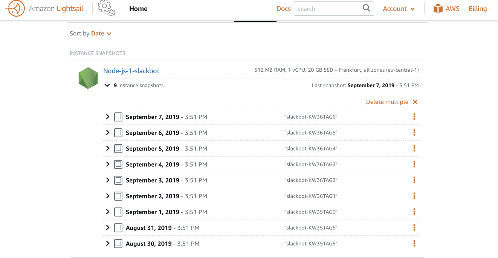
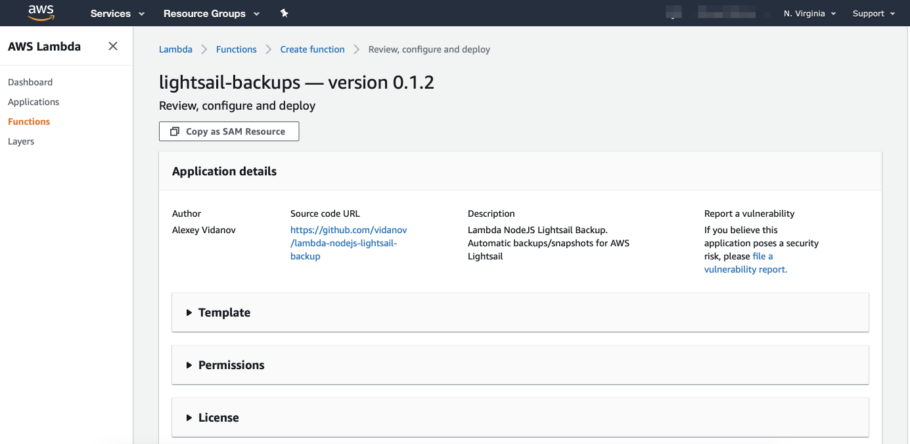
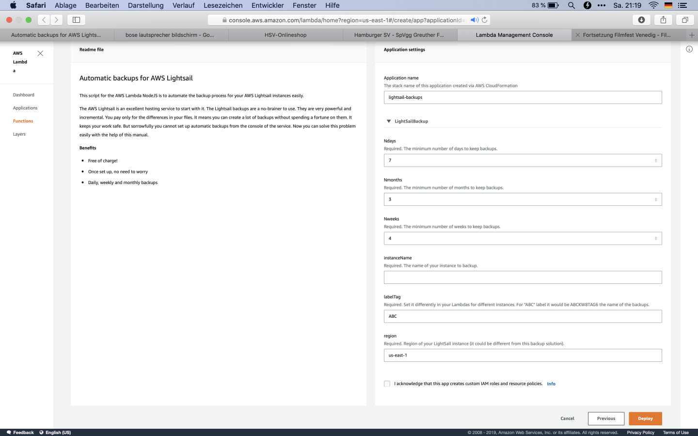

# Automatic snapshots for AWS Lightsail

**This script for the AWS Lambda NodeJS is to automate the backup process for your AWS Lightsail instances easily.** 

The AWS Lightsail is an excellent hosting service to start with it. The Lightsail snapshot backups are a no-brainer to use. They are very powerful and incremental. You pay only for the differences in your snapshot files. It means you can create a lot of snapshot backups without spending a fortune on them. It keeps your work safe. But sorrowfully you cannot set up automatic backups from the console of the service at the moment. Now you can solve this problem easily with the help of this manual.

**Benefits of the Automatic snapshots for AWS Lightsail solution**

- Free of charge and lightning fast to install!
- Once set up, no need to worry 
- Daily, weekly and monthly backups

Follow the instructions here for the setup. It is easy! We will use an AWS Serverless repository to install a Lambda function that will be scheduled to create Lightsail snapshots for you.

**Note:** you can use as an alternative you can use this  [Serverless script](serverless/README.md) and instructions for it created by Angel Abad Cerdeira. It is more technical, you will need to install [Serverless](https://serverless.com), but it is faster to deploy for multiple Lightsail instances or automate it even more.

# Setup instructions

**Attention!** The script may remove your manual snapshots if you created ones. It will be fixed soon. Keep tuned.

-----

**This setup is lightning fast and easy. It needs about 2 minutes to get it started.** 

1) You should login into your AWS account. https://aws.amazon.com

2) Open the AWS serverless repository [lightsail-backups](https://console.aws.amazon.com/lambda/home?region=us-east-1#/create/app?applicationId=arn:aws:serverlessrepo:us-east-1:278937263884:applications/lightsail-backups). 

3) Fill in the values in the Application Settings form.

- **Application name** is the name of your backup application. 
- **Ndays, Nweeks, Nmonth** define rotation period or how long your snapshots will be keeped.
- Put the name of your instance to backup in the field **instanceName** and the region in the field **Region** Your instance name and region can be found here (see image): 
  http://take.ms/3KOAo

3) Check the box "I acknowledge that this app creates custom IAM roles and resource policies."

4) Push the "Deploy button".

**That's all! Your backups will be created every day for you. You will see them in the Snapshots section of your instance in the Lightsail console.** [You can start the creation of your first backup manually](manual-start.MD).

**Notice about multiple instances backups:** If you have multiple instances, repeat the steps above for every instance, be sure to use a unique **Application name** and **labelTag** for every instance!

##YOUR KIND WORDS SUPPORT OUR WORK!

- Make suggestions and corrections.
- Write nice words in the issues section.
- Star this repository! 

## LICENSE
Copyright 2019 Alexey Vidanov, Angel Abad Cerdeira

Licensed under the Apache License, Version 2.0 (the "License");
you may not use this file except in compliance with the License.
You may obtain a copy of the License at

    http://www.apache.org/licenses/LICENSE-2.0

Unless required by applicable law or agreed to in writing, software
distributed under the License is distributed on an "AS IS" BASIS,
WITHOUT WARRANTIES OR CONDITIONS OF ANY KIND, either express or implied.
See the License for the specific language governing permissions and
limitations under the License.
