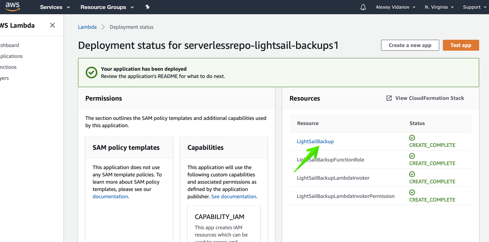
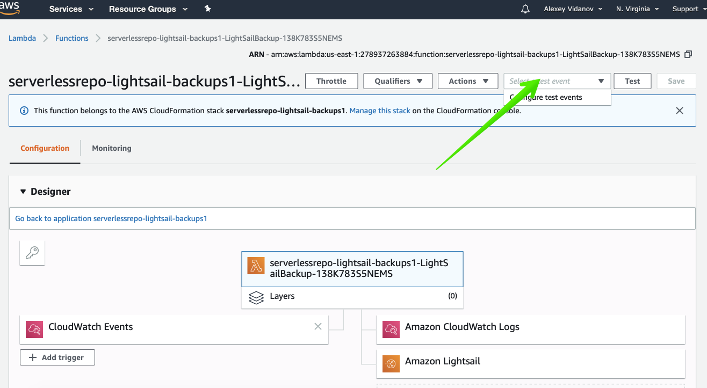
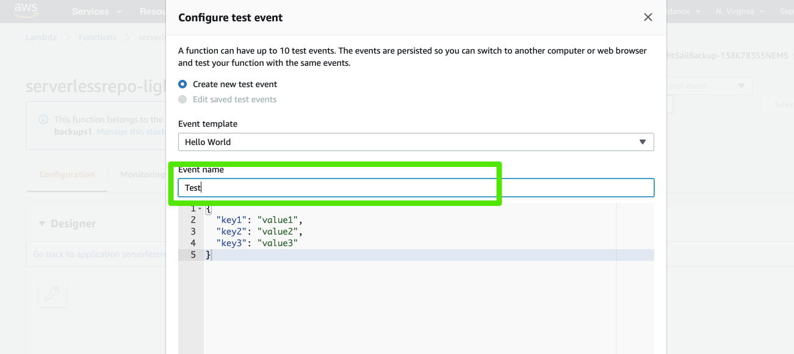
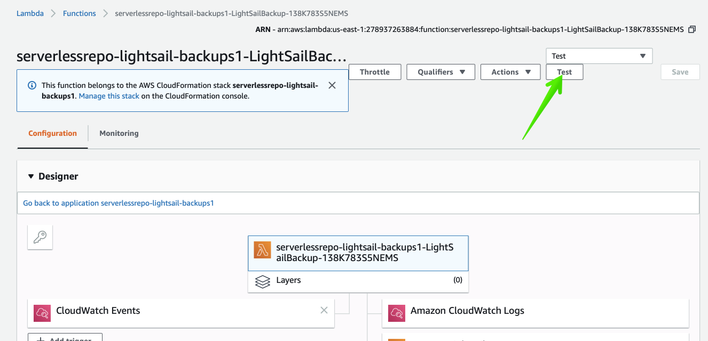

#First run

[LightSail Automatical Backup](README.MD)

1) Click the first link in the resources

2) Select test event and click "Configure test events"

3) Type in Test and the "Create" button to create the event 

4) Push the "Test" button. 

It will create the first snapshot!

